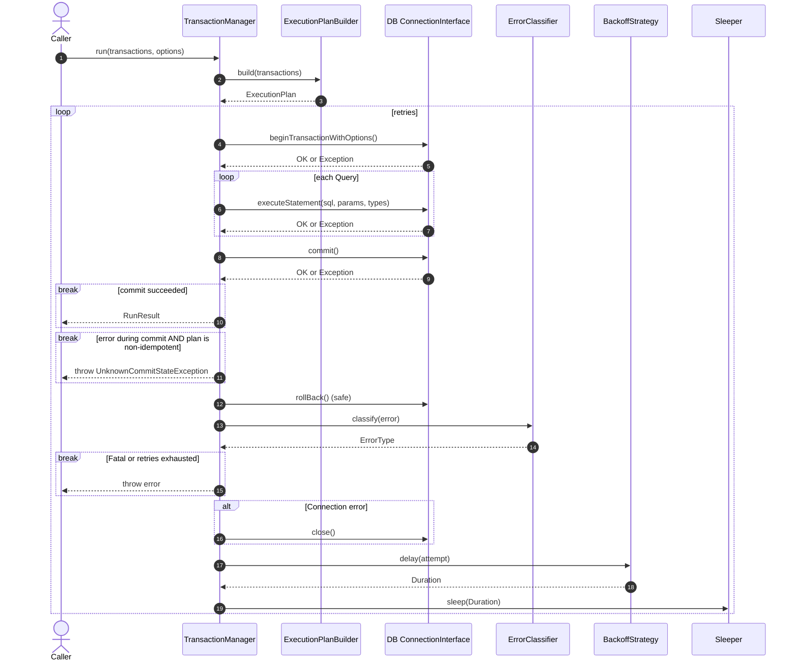

# AEATech Transaction Manager (Core)

A lightweight, DB-agnostic transaction manager designed for high-load environments,
with first-class support for:

- retries
- exponential backoff
- transient/connection error classification
- commit-unknown detection
- strict idempotency contracts
- pure SQL transaction execution

The core package contains **no DB-specific logic**.  
MySQL and PostgreSQL integrations live in separate packages:

- `transaction-manager-doctrine-adapter` (bridge for Doctrine DBAL)
- `transaction-manager-mysql`
- `transaction-manager-postgresql`

---

# Features

- Execute a sequence of SQL operations as a **single logical transaction**
- Automatically retry on transient errors (deadlocks, serialization failures)
- Automatically recovers from connection drops
- Handle `unknown commit outcome`
- IsolationLevel level control
- Pure, deterministic execution plan
- Backoff strategies (exponential with jitter)
- Pluggable error classifiers per-database
- Zero prepared-statement caching (simple and safe)
- No global state, no magic

---

If you need the full detailed contract describing all guarantees, responsibilities,
idempotency rules, error semantics, and connection requirements, see:

👉 [CONTRACT.md](./CONTRACT.md)

# Installation

```bash
composer require aea-tech/transaction-manager-core
```

# Quick Example

```php
use AEATech\TransactionManager\TransactionManager;
use AEATech\TransactionManager\TxOptions;
use AEATech\TransactionManager\RetryPolicy;
use AEATech\TransactionManager\ExponentialBackoff;
use AEATech\TransactionManager\SystemSleeper;
use AEATech\TransactionManager\ExecutionPlanBuilder;
use AEATech\TransactionManager\TransactionInterface;
use AEATech\TransactionManager\Query;
use AEATech\TransactionManager\GenericErrorClassifier;

// Assume $connectionAdapter implements AEATech\TransactionManager\ConnectionInterface
$connectionAdapter = '...';

// Assume $errorClassifier implements AEATech\TransactionManager\ErrorClassifierInterface
$errorClassifier = new GenericErrorClassifier($errorHeuristics);

$tm = new TransactionManager(
    new ExecutionPlanBuilder(),
    $connectionAdapter,
    $errorClassifier,
    new SystemSleeper()
);

class InsertUser implements TransactionInterface
{
    public function __construct(
        private string $email,
        private string $name
    ) {}

    public function build(): Query
    {
        return new Query(
            sql: "INSERT INTO users (email, name) VALUES (?, ?)",
            params: [$this->email, $this->name],
            types: [\PDO::PARAM_STR, \PDO::PARAM_STR]
        );
    }

    public function isIdempotent(): bool
    {
        return false; // inserting the same user twice is not safe
    }
}

$result = $tm->run(new InsertUser('a@example.com', 'Alice'));

echo $result->affectedRows; // → 1
```

# Idempotent Transaction Example

```php
class SetStock implements TransactionInterface
{
    public function __construct(
        private int $productId,
        private int $qty
    ) {}

    public function build(): Query
    {
        return new Query(
            sql: "UPDATE products SET stock = ? WHERE id = ?",
            params: [$this->qty, $this->productId],
            types: [\PDO::PARAM_INT, \PDO::PARAM_INT]
        );
    }

    public function isIdempotent(): bool
    {
        return true; // Setting a value twice results in the same state
    }
}
```

# Executing Multiple Transactions as One

```php
$tm->run([
    new SetStock(10, 5),
    new SetStock(11, 0),
    new InsertUser("a@example.com", "Alice"),
]);
```

# Retry Options Example

```php
use AEATech\TransactionManager\RetryPolicy;
use AEATech\TransactionManager\TxOptions;
use AEATech\TransactionManager\IsolationLevel;
use AEATech\TransactionManager\ExponentialBackoff;

$retryPolicy = new RetryPolicy(
    maxRetries: 3,
    backoffStrategy: new ExponentialBackoff(
        baseDelayMs: 10,
        maxDelayMs: 500,
        multiplier: 2.0,
        jitterMs: 60
    )
);

$options = new TxOptions(
    isolationLevel: IsolationLevel::RepeatableRead,
    retryPolicy: $retryPolicy
);

$tm->run($transaction, $options);
```

# Sequence Diagram (Execution Flow)



# Testing

The project is configured to run tests in Isolated Docker containers for different PHP versions (8.2, 8.3, 8.4).

### 1. Start the Environment

Make sure the Docker containers are up and running. From the project root:

```bash
docker-compose -p aeatech-transaction-manager-core -f docker/docker-compose.yml up -d --build
```

### 2. Install Dependencies
Install composer dependencies inside the container (using PHP 8.2 as a base):
```bash
docker-compose -p aeatech-transaction-manager-core -f docker/docker-compose.yml exec php-cli-8.2 composer install
```

# 3. Run Tests
PHP 8.2
```bash
docker-compose -p aeatech-transaction-manager-core -f docker/docker-compose.yml exec php-cli-8.2 vendor/bin/phpunit
```

PHP 8.3
```bash
docker-compose -p aeatech-transaction-manager-core -f docker/docker-compose.yml exec php-cli-8.3 vendor/bin/phpunit
```

PHP 8.4
```bash
docker-compose -p aeatech-transaction-manager-core -f docker/docker-compose.yml exec php-cli-8.4 vendor/bin/phpunit
```

### 4. Run All Tests (Bash Script)
```bash
for v in 8.2 8.3 8.4; do \
    echo "Testing PHP $v..."; \
    docker-compose -p aeatech-transaction-manager-core -f docker/docker-compose.yml exec php-cli-$v vendor/bin/phpunit || break; \
done
```

## Stopping the Environment
```bash
docker-compose -p aeatech-transaction-manager-core -f docker/docker-compose.yml down -v
```

## License

This project is licensed under the MIT License. See the [LICENSE](./LICENSE) file for details.